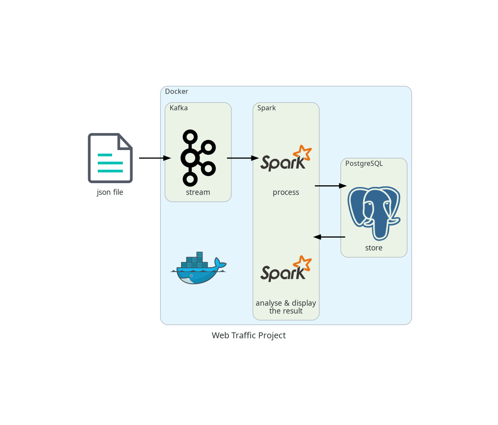

# Web Traffic
This repository provides a pipeline that processes web traffic logs stored in a json file and stores them in a parquet file. The data are generated by a script and are therefore highly simplified and not very realistic.


## Prerequisites
To use this repository, you need the following installed locally:
- [Python 3](https://www.python.org/downloads/)
- [Docker Desktop](https://docs.docker.com/desktop/) (What I used in this project)

### Python Requirements
NOTHING

## Detail Summary

| Container | Image | Tag | Accessible |
|-|-|-|-|
| zookeeper | zookeeper | 3.6.1 | 172.25.0.11:2181 |
| kafka1 | wurstmeister/kafka | 2.12-2.2.0 | 172.25.0.12:9092 |
| kafka2 | wurstmeister/kafka | 2.12-2.2.0 | 172.25.0.13:9092 |
| spark | gettyimages/spark | 3.5.0 | 172.25.0.14 |
| postgres | postgres | 13 | 172.25.0.15 |

_Note: Kafka 1 is intended to be used as the publisher and Kafka 2 is intended to be used as the consumer_

## Get Started
To use the script, follow these steps:

#### 1) Clone the repository or download the script.
```bash
git clone https://github.com/fabricemlili/web-traffic.git
```

#### 2) Navigate to the script's directory.
```bash
cd web-traffic
```

#### 3) Use Docker Compose to run kafka and spark.
```bash
sudo docker compose up -d
```

#### 4) Start data production by opening a bash in the spark docker container.
Open a new window in your terminal and enter :
```bash
sudo docker compose exec spark bash
```
Then:
```bash
cd /app
pip install kafka-python
python streaming/kafka_producer.py
```

#### 5) Start data consumption by opening a bash in the spark docker container.
Open a new window in your terminal and enter :
```bash
sudo docker compose exec spark bash
```
Then:
```bash
cd /app
pip install psycopg2-binary
spark-submit --packages org.apache.spark:spark-sql-kafka-0-10_2.12:3.5.0 --jars kafka-clients-3.8.0.jar --driver-class-path kafka-clients-3.8.0.jar processing/spark_consumer.py
```

#### 6) (Optional) Connect to PostgreSQL to view data.
```bash
sudo docker compose exec postgres psql -U user -d web_traffic_db
```
#### 7) Data analyse.
Open a new window in your terminal and enter :
```bash
sudo docker compose exec spark bash
```
Then:
```bash
spark-submit --jars postgresql-42.2.23.jar analysis/analyser.py
```

## Additional Code Snippets
```bash
pip install git+https://github.com/dpkp/kafka-python.git
pip install pyspark

sudo docker rm -f $(sudo docker ps -a -q)
sudo docker compose down
sudo docker compose up -d
```

## Author
Fabrice Mlili

## License
This project is licensed under the MIT License - see the [LICENSE](LICENSE) file for details.
